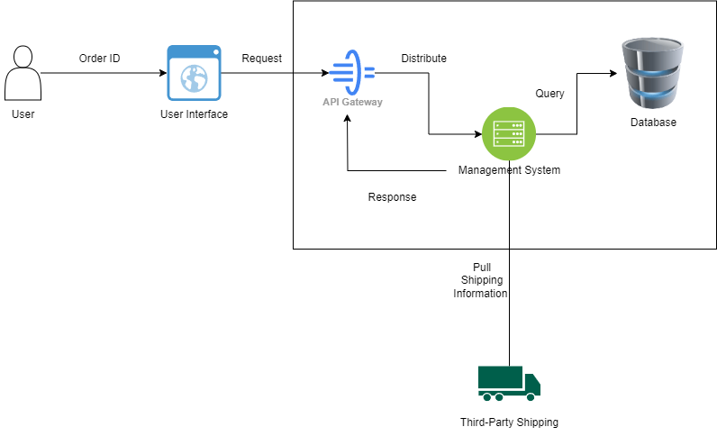
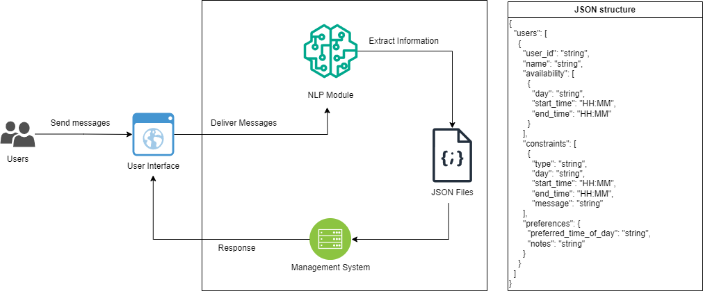

### Answer to Question 1: System Description

The system for retrieving and displaying shipping information works as follows:

1. **User**
   - **Function**: Initiates a request to check the shipping status of an order by providing the **Order ID**.
   - **Description**: Represents the customer seeking information about their order's shipping status.

2. **User Interface**
   - **Function**: Receives the **Order ID** from the user and forwards the request to the backend via the **API Gateway**.
   - **Description**: Serves as the point of interaction between the user and the system (e.g., web or mobile app).

3. **API Gateway**
   - **Function**: Acts as an intermediary, routing the user's request to the appropriate backend components, specifically the **Management System**.
   - **Description**: Manages incoming API requests and directs them to the correct service.

4. **Management System**
   - **Function**: Handles the order query by querying the **Database** for shipping information based on the provided Order ID. If necessary, retrieves real-time tracking updates from **Third-Party Shipping** providers.
   - **Description**: Core component responsible for processing order information and integrating with external services.

5. **Database**
   - **Function**: Stores order details, including status and tracking information. Provides existing shipping data when queried by the Management System.
   - **Description**: Acts as the central repository for order and shipping data.

6. **Third-Party Shipping**
   - **Function**: Provides real-time shipping updates. The Management System interacts with these services (e.g., FedEx, UPS) to retrieve the latest tracking information.
   - **Description**: External shipping carriers integrated into the system for up-to-date tracking.

### Answer to Question 2: 

1. **Users**
   - **Function**: Users provide their availability and constraints through messages.
   - **Description**: Represents individuals inputting their schedule preferences and constraints.

2. **User Interface**
   - **Function**: Captures messages from users and routes them to the NLP Module.
   - **Description**: Acts as a bridge between users and the backend, allowing users to enter their availability in natural language.

3. **NLP Module**
   - **Function**: Extracts relevant availability information from user messages using natural language processing.
   - **Description**: Parses user input to interpret dates, times, preferences, and constraints, then converts them into a structured format.

4. **JSON Files**
   - **Function**: Stores structured availability and constraint data in a readable format for easy access and processing.
   - **Description**: Acts as the primary storage system for user availability and constraints, saved in JSON format for easy integration with other components.

5. **Management System**
   - **Function**: Analyzes the data in JSON files, identifies overlapping time slots, and generates scheduling suggestions.
   - **Description**: Responsible for processing user availability and constraints, finding suitable meeting times, and sending responses back through the User Interface.

### System Workflow

1. **User Input**: Users enter availability and preferences through the User Interface (web, mobile, or chat).
2. **NLP Parsing**: The NLP Module interprets the natural language input and converts it into structured JSON data.
3. **Availability Management**: Parsed data is stored and managed in JSON files.
4. **Scheduling**: The Management System finds overlapping availability, applies preference weights, and suggests the optimal meeting time.
5. **User Confirmation**: Suggested times are displayed through the User Interface for user review.
